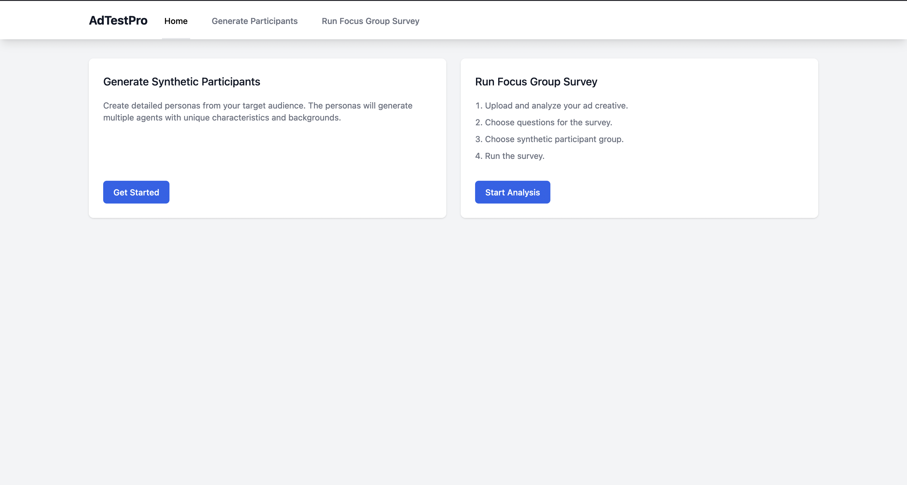
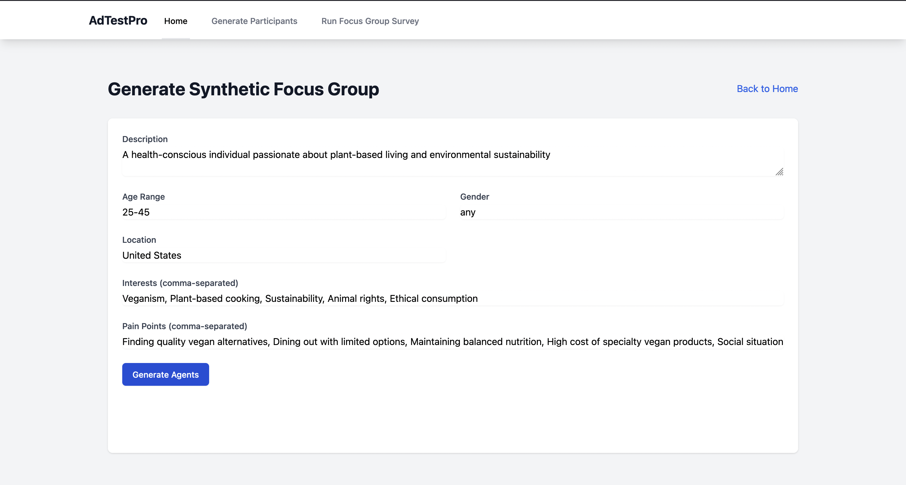
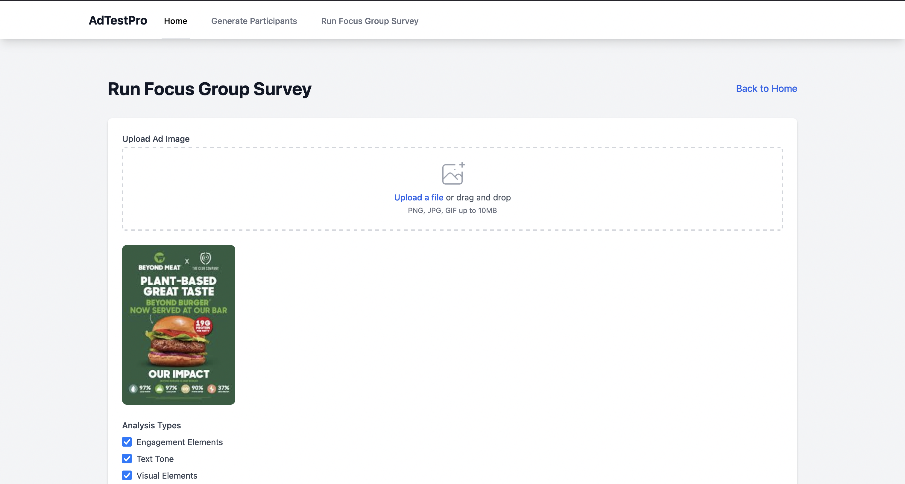
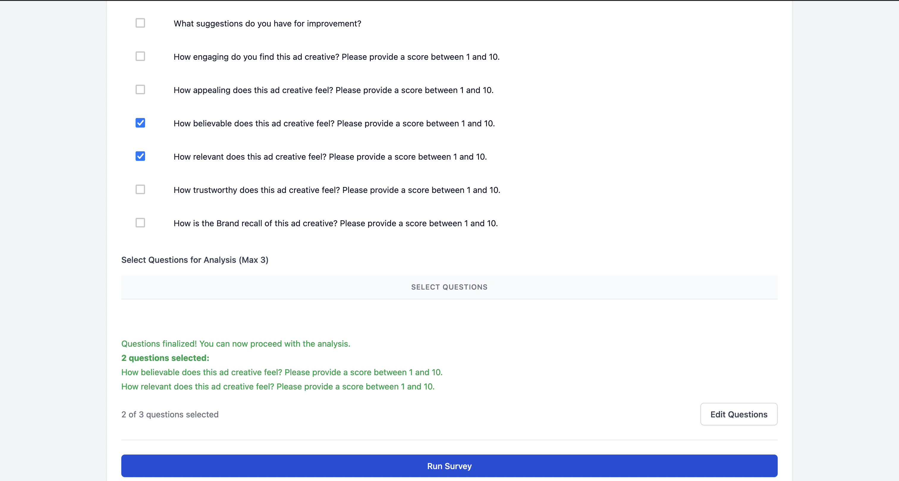

# AdTestPro: Plataforma de Pruebas de Creativos Publicitarios Impulsada por IA

⚠️ **EN DESARROLLO - NO LISTO PARA PRODUCCIÓN** ⚠️
> **Advertencia**: Este proyecto está en desarrollo activo y aún no es adecuado para su uso en producción. Las APIs, características y documentación pueden cambiar significativamente. Úselo bajo su propio riesgo.


AdTestPro es una herramienta de código abierto para obtener información cualitativa y accionable a partir de creativos publicitarios, imágenes de productos y la interfaz de usuario de aplicaciones. Aprovechamos [Personas de Expertos Simuladas por LLM] (https://arxiv.org/html/2409.12538v1) para simular diversas personas y [jueces personalizados] (https://arxiv.org/html/2406.11657v1) para puntuar la confianza y la veracidad de estas personas.

En lugar de tradicionales sesiones de grupos focales que consumen mucho tiempo, los marketers pueden validar rápidamente sus conceptos publicitarios con personas generadas por IA que representan a su audiencia objetivo.

Actualmente, AdTestPro solo admite anuncios en formato imagen.

AdTestPro se ha desarrollado para ayudar a los marketers a probar y comparar sus anuncios frente a la competencia. Identifique anticipadamente aciertos y errores, aprenda de los fallos, utilice ideas ganadoras de competidores, puntúe textos, visuales y ganchos. Obtenga información y puntuaciones dirigidas basadas en personas de usuario precisas. Reciba pasos accionables junto con la retroalimentación.

## 🚀 Características Principales

- **Generación de Personas con IA**: Crea personas detalladas y demográficamente precisas basadas en las especificaciones de su audiencia objetivo
- **Análisis Visual**: Reconocimiento de imágenes avanzado para analizar elementos publicitarios, composición e impacto emocional
- **Grupos Focales Sintéticos**: Simula discusiones de grupos focales con personas de IA que proporcionan retroalimentación auténtica y diversa
- **Métricas de Compromiso**: Mide indicadores clave de rendimiento como el recuerdo de marca, las puntuaciones de atractivo y la intención de compra
- **Informes Integrales**: Genera información detallada y recomendaciones para la optimización publicitaria

## 🎯️ Capturas de Pantalla de la Aplicación

<div align="center">
  
  <p><em>Panel de AdTestPro - Página de inicio</em></p>
  
  
  <p><em>Interfaz de Generación de Personas</em></p>
  
  
  <p><em>Subiendo Creativo Publicitario</em></p>

  
  <p><em>Seleccionar Preguntas y Ejecutar Encuesta</em></p>
</div>

## 🎯 Ideal Para

- Equipos de Marketing
- Agencias de Publicidad
- Gerentes de Marca
- Directores Creativos
- Marketers Digitales
- Analistas de Marketing

## 💡 Casos de Uso

- Validación de creativos publicitarios previo al lanzamiento
- Pruebas A/B de diferentes conceptos publicitarios
- Comprensión de la percepción de la audiencia
- Identificación de posibles problemas culturales o de comunicación
- Iteración rápida en diseños publicitarios
- Análisis de creativos publicitarios de la competencia

## 📈 Beneficios

- Reducción de los costos de pruebas en un 90%
- Obtención de retroalimentación en minutos en lugar de semanas
- Prueba de múltiples variaciones simultáneamente
- Eliminación de restricciones geográficas y logísticas
- Mantenimiento de la privacidad total de las campañas previas al lanzamiento
- Ideación rápida de conceptos publicitarios

## Descripción General

1. **Enriquecimiento de la Audiencia Objetivo**: Los usuarios pueden ingresar los detalles de su audiencia objetivo. Estos detalles se utilizan para crear [Personas de Expertos Simuladas por LLM] (https://arxiv.org/html/2409.12538v1).

2. **Extracción de Información del Creativo Publicitario**: El creativo se analiza para extraer información crítica necesaria para pruebas cualitativas, por ejemplo: tono, jerarquías visuales, OCR, marca, indicadores demográficos, diseño, tipografía, dimensiones del anuncio, propensión hacia redes sociales, etc.

3. **Grupos Focales de Personas Sintéticas**: Las personas generadas participan en una [encuesta de grupo focal] (https://studentaffairs.jhu.edu/viceprovost/assessment-analysis/assessment-tools-methods/focus-groups/) para proporcionar retroalimentación sobre los creativos. A cada persona se le muestra el anuncio junto con la información relevante extraída por un experto en publicidad/marketing. Se puntúa la confianza y la veracidad de cada persona. 

4. **Retroalimentación Consolidada**: Las respuestas y comentarios de las personas sintéticas se recopilan, analizan y se presentan al usuario en un formato fácil de entender.

Esto permite a los marketers obtener información valiosa sobre cómo podría responder su audiencia objetivo a sus anuncios, sin necesidad de un grupo focal en el mundo real.

## Primeros Pasos

Para comenzar con la versión de código abierto de AdTestPro, siga estos pasos:

1. **Clonar el Repositorio**: 
   ```
   git clone https://github.com/AnanyaP-WDW/AdTestPro.git
   ```

2. **Crear el archivo .env en la raíz**:
   Copie y pegue en .env
   ```
   OPENAI_API_KEY= PUT-YOUR-API-KEY
   ```
   Reemplace la variable PUT-YOUR-API-KEY con su propia clave de OpenAI. Consulte [.env.sample](.env.sample)

3. **Construir el contenedor Docker y ejecutarlo**:
    ```
    docker compose up
    ```

## Licencia

AdTestPro está licenciado bajo la Licencia Pública General Affero de GNU v3.0 (AGPL-3.0). Esto significa:

- Puede usar, modificar y distribuir este software libremente
- Si modifica y utiliza este software en un servicio de red, debe proporcionar el código fuente completo a los usuarios
- Cualquier modificación también debe estar licenciada bajo AGPL-3.0
- No se proporciona ninguna garantía

Para los términos completos de la licencia, consulte el archivo [LICENSE](LICENSE) en el repositorio.

Para opciones de licencia comercial, contáctenos en pathakananya95@gmail.com.

## Preguntas Frecuentes (FAQ)

1. **¿Qué es AdTestPro?**  
   AdTestPro es una herramienta que permite a los marketers utilizar personas generadas por IA para simular las reacciones de la audiencia ante los creativos publicitarios, ayudando a validar conceptos y diseños antes del lanzamiento.

2. **¿Cómo se generan las personas?**  
   Las personas se crean basándose en la información de la audiencia objetivo que proporcione. La IA luego enriquece estos datos para crear personas diversas que simulan varios segmentos de audiencia.

3. **¿Cómo uso esta herramienta para probar creativos publicitarios?**  
   Simplemente ingrese su creativo publicitario y los detalles de su audiencia objetivo. El sistema analizará y extraerá detalles clave sobre su anuncio, y las personas proporcionarán retroalimentación basada en estos atributos.

4. **¿Existe una versión de pago de AdTestPro?**  
   ¡Sí! Existe una versión comercial disponible, que ofrece características adicionales, soporte dedicado y servicios de configuración/despliegue. Contáctenos en [pathakananya95@gmail.com](mailto:pathakananya95@gmail.com) para más detalles.

5. **¿Puedo personalizar las personas?**  
   Absolutamente. Puede personalizar sus personas basándose en demografías específicas, preferencias y rasgos de comportamiento para adaptarse mejor a sus necesidades de pruebas publicitarias.

6. **¿Cómo puedo contribuir al proyecto?**  
   ¡Damos la bienvenida a las contribuciones! Puede bifurcar el repositorio, realizar cambios y enviar una solicitud de extracción (pull request). Consulte la sección **Contribuir** anterior para obtener más detalles.\

7. **¿Cuál es la metodología central?**
   AdTestPro utiliza LLM-as-a-Personalized-Judge (¡En desarrollo!), es una técnica que incorpora la estimación de incertidumbre verbal en el pipeline del LLM, lo que permite al modelo expresar baja confianza en juicios inciertos. Para mayor comprensión, consulte [¿Puede un LLM ser un Juez Personalizado?](https://arxiv.org/html/2406.11657v1)


## Licenciamiento Comercial y Soporte

Además de la versión de código abierto, AdTestPro también ofrece opciones de licenciamiento y soporte comercial para empresas:

1. **Licenciamiento Comercial**: Las organizaciones pueden comprar una licencia comercial para usar AdTestPro en un entorno de producción. Esto incluye acceso a funciones premium, soporte dedicado y un SLA garantizado.

2. **Configuración y Despliegue de Pago**: Para empresas, AdTestPro ofrece un servicio de configuración y despliegue de pago. Esto incluye asistencia para integrar la plataforma en su stack de tecnología de marketing existente, así como capacitación integral para su equipo.

3. **Mantenimiento y Soporte**: Los clientes comerciales también tienen acceso a mantenimiento y soporte continuo para la plataforma AdTestPro. Esto incluye correcciones de errores, actualizaciones de características y soporte dedicado por parte de nuestro equipo de expertos.

Para conocer más sobre las ofertas comerciales y los precios, <!--por favor visite nuestro [sitio web](https://www.syntheticadtesting.com) --> contacte a pathakananya95@gmail.com.

## Tareas Pendientes (TODO)

1. En la página de ver personas generadas, agregar una subpágina de ver detalles
2. En la página de ejecutar encuesta de grupo focal, a veces el botón de finalizar preguntas no renderiza las preguntas seleccionadas
3. El resaltado de la pestaña de navegación no funciona correctamente - por ejemplo: cuando la página de generar personas está abierta, la pestaña de navegación sigue resaltando inicio
4. En la página de generar personas, cuando se hace clic en el botón ver personas, redirige a la página correcta pero sin las pestañas de navegación del encabezado
5. No hay forma de seleccionar las personas en la página de ejecutar encuesta de grupo focal
6. El formulario en la página de ejecutar grupo focal no parece coherente
7. Algunas rutas de API fallan inesperadamente
8. Agregar resultados -> mejor manera de mostrar los resultados junto con la puntuación de confianza y veracidad de la persona
9. Para escalabilidad, agregar Celery para encolar resultados -> corredor Redis y cola de resultados
