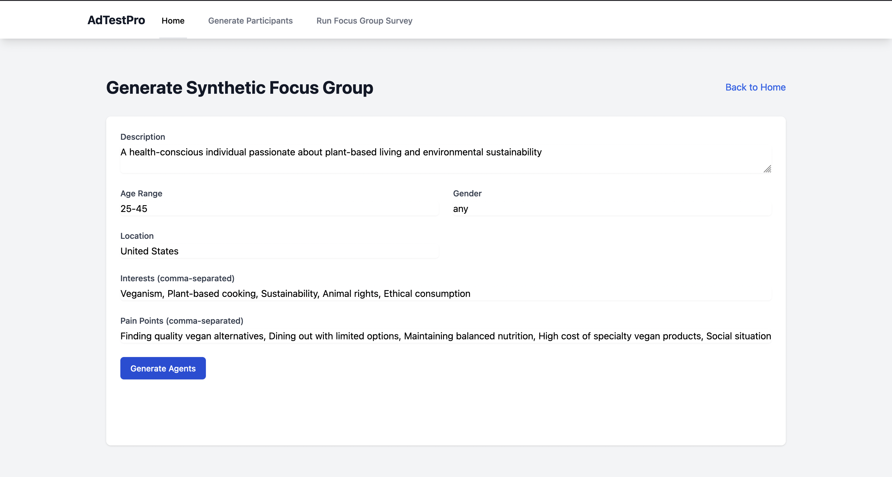
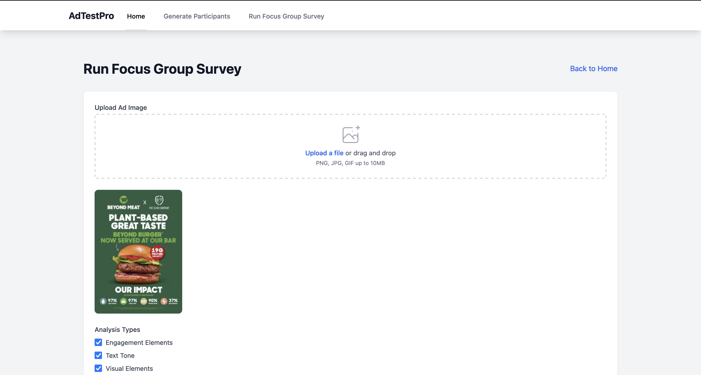
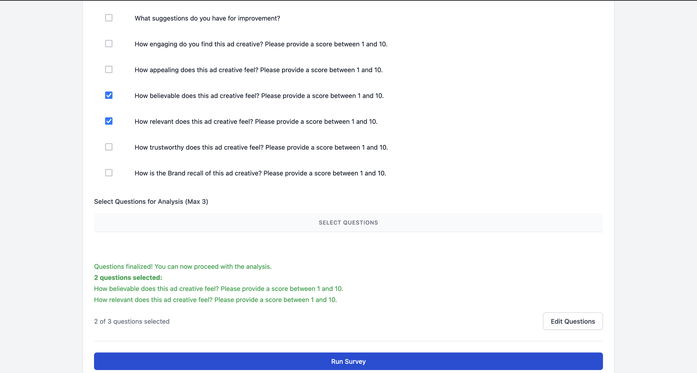

# AdTestPro: AI-Powered Ad Creative Testing Platform

⚠️ **WORK IN PROGRESS - NOT PRODUCTION READY** ⚠️
> **Warning**: This project is under active development and is not yet suitable for production use. APIs, features, and documentation may change significantly. Use at your own risk.


AdTestPro is an open-source tool to gain qualitative and actionable insights from ad creatives, Product images and app UI. We leverage [LLM-Simulated Expert Personas] (https://arxiv.org/html/2409.12538v1) to simulate diverse personas and [personalized judges] (https://arxiv.org/html/2406.11657v1) to score the confidence and truthfullness of theses personas.

Instead of traditional, time-consuming focus group sessions, marketers can quickly validate their ad concepts with AI-generated personas that represent their target audience.

Right now AdTestPro only supports image ad's.

AdTestPro is developed to help marketers test and compare their ad copies against their competitors.  Pre-emptively identify wins and losses, learn from mistakes, use competitors winning ideas, score copy, visuals and hooks. Get targeted insights and scoring based on precise user personas. Get actionable steps along with the feedback

## 🚀 Key Features

- **AI Persona Generation**: Creates detailed, demographically accurate personas based on your target audience specifications
- **Visual Analysis**: Advanced image recognition to analyze ad elements, composition, and emotional impact
- **Synthetic Focus Groups**: Simulates focus group discussions with AI personas providing authentic, diverse feedback
- **Engagement Metrics**: Measures key performance indicators like brand recall, appeal scores, and purchase intent
- **Comprehensive Reports**: Generates detailed insights and recommendations for ad optimization

## 🎯️ App Screenshots

<div align="center">
  
  <p><em>AdTestPro Dashboard - Home page</em></p>
  
  
  <p><em>Persona Generation Interface</em></p>
  
  
  <p><em>Uploading Ad Creative</em></p>

  
  <p><em>Choose Questions and Run Survey</em></p>
</div>

## 🎯 Perfect For

- Marketing Teams
- Ad Agencies
- Brand Managers
- Creative Directors
- Digital Marketers
- Marketing Analysts

## 💡 Use Cases

- Pre-launch ad creative validation
- A/B testing different ad concepts
- Understanding audience perception
- Identifying potential cultural or messaging issues
- Rapid iteration on ad designs
- Competitor ad creative analysis

## 📈 Benefits

- Reduce testing costs by 90%
- Get feedback in minutes instead of weeks
- Test multiple variations simultaneously
- Eliminate geographical and logistical constraints
- Maintain complete privacy of pre-launch campaigns
- Ideate ad concepts quickly

## Overview

1. **Target Audience Enrichment**: Users can enter their target audience details. These deatails are used to create [LLM-Simulated Expert Personas] (https://arxiv.org/html/2409.12538v1).

2. **Ad Creative Information Extraction**: The ad creative is analysed to extract critical information needed for qualitative testing ex: tone, visual hierarchies, OCR, branding, demographic indicators, design ,font ,ad dimensions, procilivity towards social media networks etc.

3. **Synthetic Persona Focus Groups**: The generated personas participate in a [focus group survey] (https://studentaffairs.jhu.edu/viceprovost/assessment-analysis/assessment-tools-methods/focus-groups/) to provide feedback on the ad creatives. Each persona is shown the ad along with relevant information extracted by an ad/marketing expert. Each persona's confidence and truthfullness are scored. 

4. **Consolidated Feedback**: The responses and feedback from the synthetic personas are collected, analyzed, and presented to the user in an easy-to-understand format.

This allows marketers to get valuable insights into how their target audience might respond to their ads, without the need for a real-world focus group.

## Getting Started

To get started with the open-source version of AdTestPro, follow these steps:

1. **Clone the Repository**: 
   ```
   git clone https://github.com/AnanyaP-WDW/AdTestPro.git
   ```

2. **Create .env file in root**:
   Copy paste in .env
   ```
   OPENAI_API_KEY= PUT-YOUR-API-KEY
   ```
   Replace variable PUT-YOUR-API-KEY with your own OpenAI key. Refer to [.env.sample](.env.sample)

3. **Build docker container and run**:
    ```
    docker compose up
    ```

## License

AdTestPro is licensed under the GNU Affero General Public License v3.0 (AGPL-3.0). This means:

- You can use, modify, and distribute this software freely
- If you modify and use this software in a network service, you must provide the complete source code to users
- Any modifications must also be licensed under AGPL-3.0
- No warranty is provided

For the complete license terms, see the [LICENSE](LICENSE) file in the repository.

For commercial licensing options, please contact pathakananya95@gmail.com.

## Frequently Asked Questions (FAQ)

1. **What is AdTestPro?**  
   AdTestPro is a tool that enables marketers to use AI-generated personas to simulate audience reactions to ad creatives, helping validate ad concepts and designs before launch.

2. **How are the personas generated?**  
   Personas are created based on the target audience information you provide. AI then enriches this data to create diverse personas that simulate various audience segments.

3. **How do I use this tool for ad creative testing?**  
   Simply input your ad creative and target audience details. The system will analyze and extract key details about your ad, and the personas will provide feedback based on these attributes.

4. **Is there a paid version of AdTestPro?**  
   Yes! A commercial version is available, offering additional features, dedicated support, and setup/deployment services. Contact us at [pathakananya95@gmail.com](mailto:pathakananya95@gmail.com) for more details.

5. **Can I customize the personas?**  
   Absolutely. You can customize your personas based on specific demographics, preferences, and behavioral traits to better fit your ad testing needs.

6. **How can I contribute to the project?**  
   We welcome contributions! You can fork the repo, make changes, and submit a pull request. Refer to the **Contributing** section above for details.\

7. **What is the core methodology?**
   AdTestPro uses LLM-as-a-Personalized-Judge (WIP!), it's a technique that incorporates verbal uncertainty estimation into the LLM pipeline, this allows the model to express low confidence on uncertain judgments. For more understanding please refer to [Can LLM be a Personalized Judge?](https://arxiv.org/html/2406.11657v1)


## Commercial Licensing and Support

In addition to the open-source version, AdTestPro also offers commercial licensing and support options for businesses:

1. **Commercial Licensing**: Organizations can purchase a commercial license to use AdTestPro in a production environment. This includes access to premium features, dedicated support, and a guaranteed SLA.

2. **Paid Setup and Deployment**: For enterprises, AdTestPro offers a paid setup and deployment service. This includes assistance with integrating the platform into your existing marketing technology stack, as well as comprehensive training for your team.

3. **Maintenance and Support**: Commercial customers also have access to ongoing maintenance and support for the AdTestPro platform. This includes bug fixes, feature updates, and dedicated support from our team of experts.

To learn more about the commercial offerings and pricing, <!--please visit our [website](https://www.syntheticadtesting.com) --> contact pathakananya95@gmail.com.

