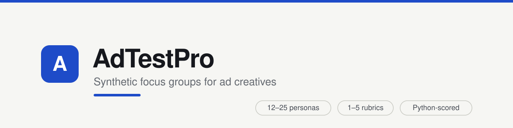
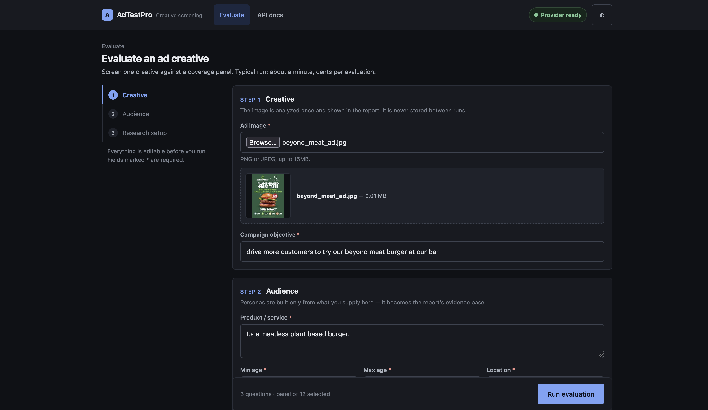
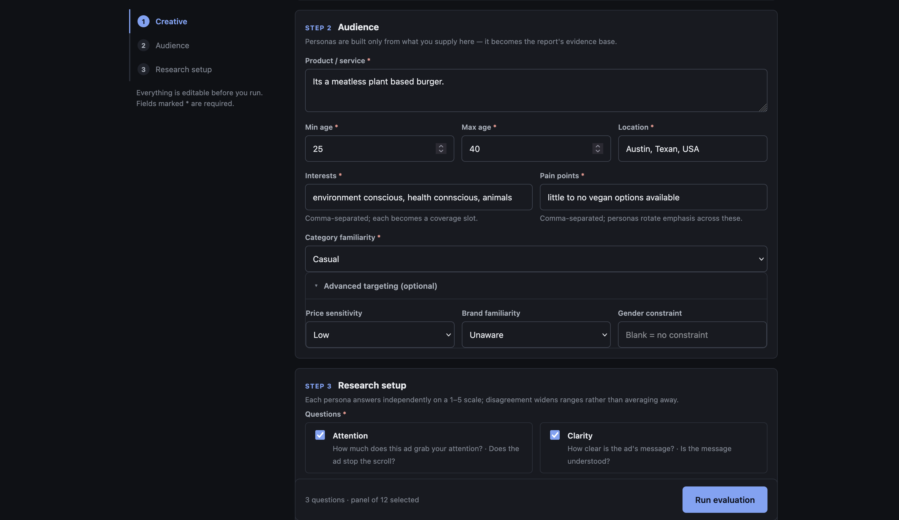
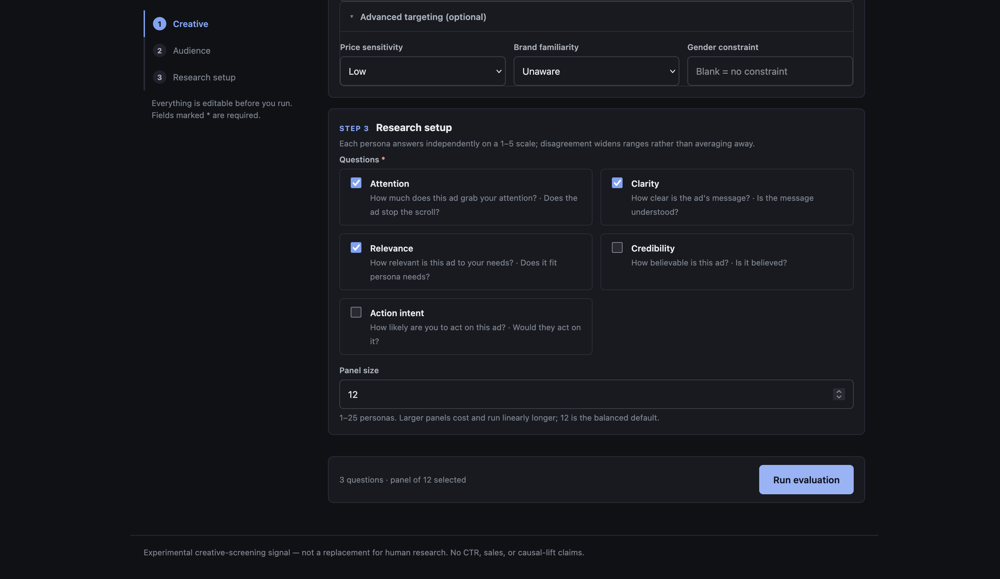
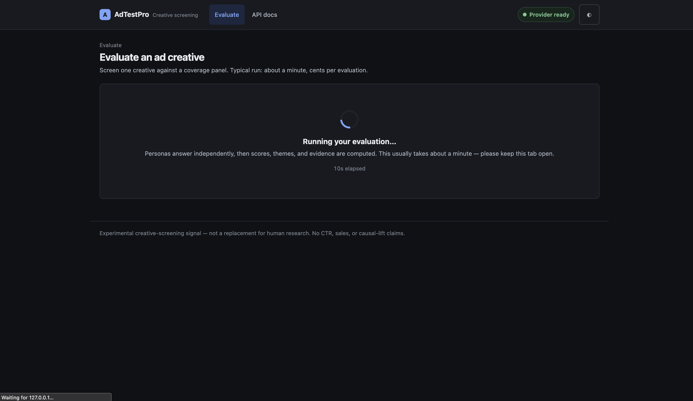
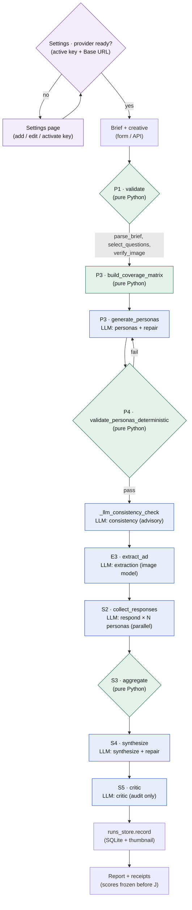

<p align="center">
  <picture>
    <source media="(prefers-color-scheme: dark)" srcset="assets/banner-dark.svg">
    
  </picture>
</p>

<h1 align="center">AdTestPro</h1>

<p align="center">
  <a href="https://github.com/AnanyaP-WDW/AdTestPro/actions/workflows/ci.yml"></a>
  <a href="https://github.com/AnanyaP-WDW/AdTestPro/blob/main/LICENSE"></a>
  
  
  
</p>

<p align="center">
  <strong>Upload an ad. Get a coverage panel of up to 25 AI respondents (default 12),
  structured extraction, dimension scores with disagreement flags, and
  evidence-linked recommendations — in one to three minutes, for cents per run.</strong>
</p>

<p align="center">
  ⭐ If this tool helped you, please <a href="https://github.com/AnanyaP-WDW/AdTestPro/stargazers">leave a star</a> to help others find it!
</p>

> **Honest label.** AdTestPro produces schema-valid, evidence-linked ad evaluations.
> It is an experimental creative-screening signal — not a replacement for human
> research — and it makes no CTR, sales, or causal-lift claims.

> **License.** Open source under **GPLv3**; commercial or proprietary use requires a
> **commercial license** (per-developer / team / organization). See [License](#license).

[Features](#features) · [Quickstart](#quickstart) · [Configuration](#configuration) · [API](#api) · [How it works](#how-it-works) · [Benchmarks](#docs--rigor) · [Research](#research-grounding) · [Roadmap](#roadmap) · [License](#license)

## See it in action

| Guided brief | Audience definition |
|---|---|
| **Step 1** — upload the creative with an instant local preview; it is analyzed once and never stored between runs. | **Step 2** — personas are built only from what you supply: ages, location, interests, pain points, familiarity, plus optional targeting. |
|  |  |

| Research setup | Honest pending state |
|---|---|
| **Step 3** — pick up to 3 scoring dimensions and size the panel (1–25 personas); the run summary tracks your selection. | No fake progress bars: one status line and an elapsed timer while personas answer independently. |
|  |  |

## Why it exists

Human panels are slow and expensive; gut-feel creative review is fast but uncalibrated.
AdTestPro sits between: a **bounded, auditable pipeline** where LLMs produce
evidence-grounded judgments and **Python computes every number**. The model never
writes a final score.

## Features

| Capability | What you get |
|---|---|
| **Coverage panel, not fake people** | Up to 25 personas (default 12) spanning your pain points, interests, familiarity, price sensitivity, and skeptical→receptive stance. Every fact traces to your brief (`supplied`) vs. inference (`hypothesis + basis`). No names, no backstories, no sensitive attributes. |
| **Observation vs. interpretation split** | Visible text (exact), brand, claims, CTA with evidence quotes and image regions — kept separate from tone/symbolism/persuasion reads. Missing logo, price, or CTA stays `unknown`, never invented. |
| **Stable 1–5 rubrics** | Attention, clarity, relevance, credibility, action intent — each with behavioral anchors. Disagreement widens the range instead of averaging it away; minority views survive synthesis by construction. |
| **Model hedge** | Optional `ADTESTPRO_MODELS` pool rotates models across personas during scoring, so one vendor's priors can't dominate every judgment. Image extraction uses a dedicated vision model. Per-call models recorded in receipts. |
| **Receipts** | Every run records model IDs, prompt hashes, token use, latency, repairs, warnings, and code revision. Cached replay is bit-for-bit deterministic. |
| **Self-hosted provider keys & models** | From the **Settings** tab, add / edit / activate / reveal / delete named provider keys (each with its own Base URL) and pick the primary model, scoring pool, and image model from the tested checkboxes. Secrets stay in gitignored `settings.local.json` (mode 0600) or your OS keychain; keys are never read from `.env`. |
| **Visual report + PDF export** | Ranked dimension means (±1 sd), rating distributions, a persona×dimension heatmap, a profile radar, panel composition, theme sentiment, model mix, and evidence confidence — all plain HTML/CSS, so the one-click **PDF** carries the same data as the page. |
| **Professional operator UI** | Guided three-step form, local image preview, field-level validation, honest pending state, decision-ready report with distributions and evidence anchors. Light/dark, keyboard-accessible, no CDN dependencies. |

## Quickstart

```bash
python -m venv venv && source venv/bin/activate
pip install -r requirements.txt
uvicorn app.main:app --reload
```

Open `http://localhost:8000/settings`, add your provider key (OpenAI, or OpenRouter —
set the key's Base URL to `https://openrouter.ai/api/v1`), and activate it. Keys are
stored in gitignored `settings.local.json` (mode 0600); `.env` keys are not read.

Models are chosen here too, in the **Settings** tab's **Models** section: the primary
text model, an optional scoring pool (the tested checkboxes), the image model, and the
per-call timeout — no env files required.

Then open `http://localhost:8000/`, fill the brief, upload a PNG/JPEG (≤15MB), pick up to
3 questions, set the panel size, and run. `GET /ready` reports `{"ready": true}` when
configured; `GET /health` is the offline liveness probe.

Every stored run can be downloaded as a **PDF** from the report page or the Runs list —
the same sections, numbers, and charts as the page, laid out for print. PDF export uses
WeasyPrint; it needs pango/cairo system libraries (the Docker image installs them, on
macOS `brew install pango`). If they are missing the button is hidden and the route
returns 503, so the app still runs.

Docker alternative:

```bash
docker compose up --build
```

**Model config** — set in the **Settings** tab's **Models** section, or via env (UI
values override env):

```bash
ADTESTPRO_MODEL=openai/gpt-4o-mini   # must be vision-capable
ADTESTPRO_MODELS=openai/gpt-4o-mini,anthropic/claude-sonnet-5,deepseek/deepseek-v4-flash
```

## Configuration

| Variable | Required | Default | Purpose |
|---|---|---|---|
| Provider key | via UI | — | Add/activate in **Settings → Provider**; stored in `settings.local.json`, not read from `.env` |
| Base URL | via UI | — | Per-key in **Settings → Provider** (e.g. OpenRouter); `ADTESTPRO_BASE_URL` env applies to the benchmark CLI only |
| `OPENAI_API_KEY` | no | — | Used only by `benchmarks/evaluate.py` live runs and other direct `llm.shared_client` consumers |
| `ADTESTPRO_MODEL` | no | `gpt-4o-mini-2024-07-18` | Primary model ID (vision-capable for extraction). Set in **Settings → Models** or via env |
| `ADTESTPRO_MODELS` | no | — | Comma-separated pool rotated across personas during scoring (the debias hedge). Pick the tested checkboxes in **Settings → Models**, or via env |
| `ADTESTPRO_IMAGE_MODEL` | no | primary model | Dedicated vision model for the single image-extraction call; must accept image inputs. Set in **Settings → Models** or via env |
| `ADTESTPRO_MAX_CONCURRENCY` | no | `4` | Max concurrent provider calls |
| `ADTESTPRO_TIMEOUT_S` | no | `60` | Per-call timeout (set 120+ for ~6k-token structured generations) |
| `ADTESTPRO_PIPELINE_TIMEOUT_S` | no | `300` | Whole-run wall-clock budget |
| `ALLOWED_ORIGINS` | no | `http://localhost:8000,…` | CORS allowlist |
| `ADTESTPRO_LOG_LEVEL` | no | `INFO` | Terminal log level |
| `ADTESTPRO_REVISION` | no | — | Code revision stamped in receipts when git is unavailable (containers) |

## API

```bash
curl -X POST http://localhost:8000/api/evaluations \
  -F product_description="Reusable water bottle" \
  -F campaign_objective="Test launch creative" \
  -F age_min=25 -F age_max=40 \
  -F location="Austin, USA" \
  -F interests="running, coffee" \
  -F pain_points="lack of time, plastic waste" \
  -F category_familiarity=casual \
  -F question_ids=attention,clarity \
  -F persona_count=12 \
  -F image=@ad.png
```

Returns a single `EvaluationResult`: `status`, `brief`, `personas`, `extraction`,
`responses`, `scores.per_question` (mean, median, stdev, distribution, disagreement),
`themes`, `recommendations`, `uncertainty`, and a full `trace` of provider calls.
Optional `Idempotency-Key` header replays safely. Full contracts: `/openapi.json`,
interactive docs at `/docs`.

Cost: ~$0.05–0.15 per 12-persona × 3-question run, scaling linearly with panel size.

## How it works — Flash Poll (fixed-question panel)


```mermaid
flowchart TD
    A0{"Settings · provider ready?<br/>(active key + Base URL)"}
    A0 -->|"no"| S0["Settings page<br/>(add / edit / activate key)"]
    S0 --> A0
    A0 -->|"yes"| A["Brief + creative<br/>(form / API)"]
    A --> B{"P1 · validate<br/>(pure Python)"}
    B -->|"parse_brief, select_questions,<br/>verify_image"| C["P3 · build_coverage_matrix<br/>(pure Python)"]
    C --> D["P3 · generate_personas<br/>LLM: personas + repair"]
    D --> E{"P4 · validate_personas_deterministic<br/>(pure Python)"}
    E -->|"fail"| D
    E -->|"pass"| F["_llm_consistency_check<br/>LLM: consistency (advisory)"]
    F --> G["E3 · extract_ad<br/>LLM: extraction (image model)"]
    G --> H["S2 · collect_responses<br/>LLM: respond × N personas (parallel)"]
    H --> I{"S3 · aggregate<br/>(pure Python)"}
    I --> J["S4 · synthesize<br/>LLM: synthesize + repair"]
    J --> K["S5 · critic<br/>LLM: critic (audit only)"]
    K --> M["runs_store.record<br/>(SQLite + thumbnail)"]
    M --> L["Report + receipts<br/>(scores frozen before J)"]

    classDef llm fill:#e8edfb,stroke:#1e4bc8,color:#16181d;
    classDef py fill:#e4f2e9,stroke:#14663c,color:#16181d;
    classDef ui fill:#f3ecfb,stroke:#6b3fa0,color:#16181d;
    class A0,S0 ui;
    class D,F,G,H,J,K llm;
    class B,C,E,I py;
```

Blue stages are bounded LLM calls (one repair pass each, fully traced); green stages
are pure Python; purple stages are the Settings/provider gate. The run starts only
when a stored key is active (`/ready`); the aggregation step freezes scores before
synthesis and the critic run — the model can contextualize numbers but never move
them. The consistency check is advisory-only (warns, never blocks); the respond
fan-out fires N parallel calls (4-at-a-time), each tagged with its pool model.
Every terminal run is then recorded to local SQLite for history.

## Settings & run history

- **Settings** (nav bar) — **Provider** and **Models** sections: manage named
  provider keys (**add / edit / activate / reveal / delete**), each with its own
  Base URL; in the same page choose the primary text model, an optional scoring
  pool (tested models only), the image model, and the per-call timeout — plus a
  one-click connection test on the active key. Secrets are stored
  in gitignored `settings.local.json` (mode 0600) by default, or in the **OS keychain**
  (Keychain / Credential Manager / Secret Service) when that toggle is enabled and the
  `keyring` package is installed. Provider keys are never read from `.env`; that env
  path remains for the benchmark CLI.
- **Runs** (nav bar): every terminal evaluation — browser or API, success or
  failure — is recorded in local SQLite (`data/adtestpro.db`, stdlib only) with
  its full report and thumbnail. Keys are never stored.
- Single-user assumption: settings and history are server-global. Concurrent
  users would share them — multi-user isolation needs auth and is out of scope.

## Docs & rigor

- `benchmarks/README.md` — PersonaBench / AdExtract-60 / AdScore-24 protocols, gate
  thresholds, and what's blocked on human data
- `benchmarks/evaluate.py` — metrics + deterministic replay (`replay-cached`, `replay-fresh`)
- 161 offline tests (`pytest tests/`) run the full pipeline on fixtures with zero network

## Research grounding

<details>
<summary><strong>Academic (most-cited first)</strong></summary>

1. Generative Agents (Park et al., Stanford/Google, UIST'23) — 25-agent society — <https://arxiv.org/abs/2304.03442>
2. Out of One, Many / Silicon Samples (Argyle et al., 2022/23) — template for persona conditioning — <https://arxiv.org/abs/2209.06899>
3. Automatic Understanding of Image/Video Ads (Hussain et al., CVPR'17) — Pitt Ads 64k benchmark — <https://people.cs.pitt.edu/~kovashka/ads/>
4. Generative Agent Simulations of 1,000 People (Stanford, 2024) — <https://arxiv.org/abs/2411.10109>
5. Persuasion Strategies in Ads (AAAI'23) — <https://doi.org/10.1609/aaai.v37i1.25076>
6. Focus Agent: LLM Virtual Focus Group (2024) — <https://arxiv.org/html/2409.01907>
7. ADVI-SOR (ACL Industry'26) — <https://aclanthology.org/2026.acl-industry.28.pdf>
8. TRADE (ACL'24) — <https://aclanthology.org/2024.acl-short.77.pdf>

</details>

<details>
<summary><strong>Industry / popular</strong></summary>

9. Microsoft TinyTroupe — <https://github.com/microsoft/TinyTroupe>
10. I Asked 100 AI Agents to Judge an Ad (Every.to, 2025) — <https://every.to/also-true-for-humans/how-i-made-ai-think-like-a-focus-group>
11. Evidenza / Toluna Instant / SyntheticUsers + FishDog — <https://www.evidenza.ai/>
12. your-ai-focus-group (OSS near-clone) — <https://github.com/shagghiesuperstar/your-ai-focus-group>

</details>

## Roadmap

| Capability | Status |
|---|---|
| Coverage panel, extraction, rubric scoring, synthesis, critic | **Shipped** |
| User-defined panel size (1–25) | **Shipped** |
| Multi-model debias hedge | **Shipped** |
| Saved runs / history / shareable report URLs | Not started — requires persistence layer |
| Side-by-side creative comparison | Planned after persistence |
| Human-panel calibration for benchmark gates | **Blocked on human data** |

## Security notes

Never commit `.env` or `settings.local.json`. Provider keys are owned by the Settings
UI: stored in `settings.local.json` (mode 0600) or, when enabled, the OS keychain — not
read from the environment. The app never logs keys, prompts, images, or persona profiles
— run logs carry IDs, stage timings, and token counts exclusively.

## Contributing

Issues and PRs welcome. Keep the project's honest-label tone: no inflated claims, and
every new scoring behavior ships with offline tests.

## License

AdTestPro is **dual-licensed**:

- **Open source** — [GNU GPLv3](LICENSE). Free to use, modify, and self-host if your
  project is also released under a GPLv3-compatible license.
- **Commercial** — required for proprietary products, commercial sites, projects, and
  applications where you keep your source private, including products you sell.
  Per-developer, team, and organization tiers are available at
  <https://adtestpro.com/license> or via support@adtestpro.com.

Copyright (c) 2026 Ananya Pathak. All rights reserved.
